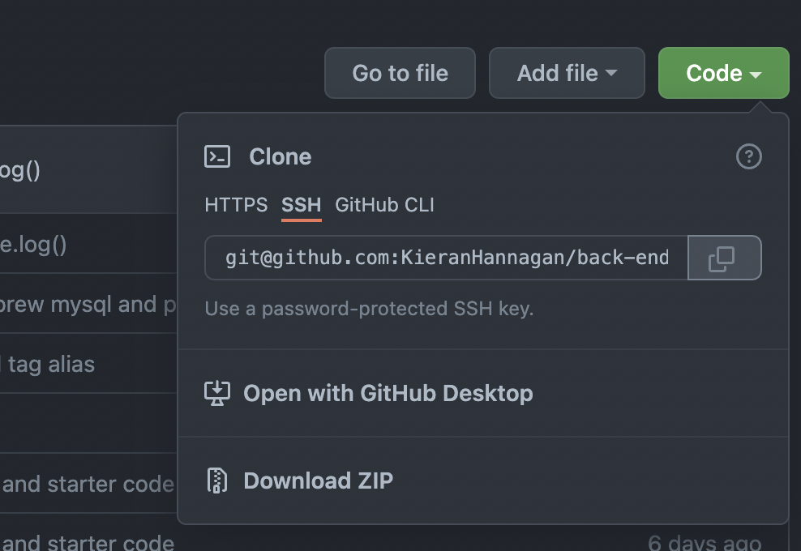
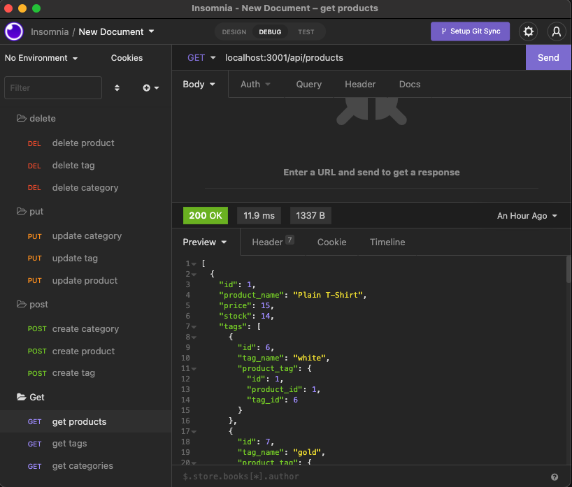

# back-end-commerce
          
  ## Description
This is a CRUD application that allows users to preform queries on a theoretical e-commerce site. This repository is only the backend, there is no deployed application so if you would like to use it you will have to clone this repo (see [Installation](#installation)). This is a Node.js application that uses express for servers, MySQL for the database and sequelize as the ORM (refer to usage for `package.json`). 

There are three models you can preform a query on, Products, Categories and Tags. Catagories have the outer-most layer of the relationship structure within the three models, giving it a `one to many` relationship. Additionally, the products live within the catagories and all the tags live below the products. However, the tags have a `many-to-many` relationship with the products, meaning they can belong to multiple product lines.
  
  * [Installation](#installation)
  * [Usage](#usage)
  * [Test](#tests)
  * [Questions](#questions)
  * [GitHub](#github)
  * [Email](#email)
  
  ## Installation 

        NOTE: Version 7 of sequelize only works with node versions 12.22.0, 14.17.0 & 16.0.0

  Clone the repo in your terminal using shell and navigate to your newly cloned directory. You will then want to open the file in your preferred coding software.
        

  ### MySQL
  You will need to have MySQL installed and have access to run the program from anywhere. It will  need to have an instance running in the background. 

   You will also need to have a `.env` file in your root directory. 
  This file must contain the following three things:

   * `DB_NAME="ecommerce_db"`
   * `DB_USER="your MySQL username"`
   * `DB_PW="your MySQL password"`

  ## Usage 
This application uses Node.js dependencies, here is the list of packages that should come ready in your `package.json` :

            "dependencies": {
        "dotenv": "^16.0.0",
        "express": "^4.17.3",
        "mysql2": "^2.3.3",
        "sequelize": "^6.17.0"
        }

To initialize the application and insure that these packages are running locally, run `npm install` from your terminal in the root of the application. You will then want to create the data base through the MySQL shell, using `source db/schema.sql` and seed the data from your regular shell by using `npm run seed`. Finally, you can start your server with `npm start` and start accessing the endpoints. 
List of localhost endpoints:

* api/categories
* api/products
* api/tags

Watch the [video](https://www.youtube.com/watch?v=YYb9-nQnW9I) below for reference:

  ## Tests 
  Watch the video above for live testing examples using [Insomnia](https://insomnia.rest/download).

  ## Questions
  If you have any questions, feel free to reach out and contact me via email.
  ### Email
  kieranhan1999@gmail.com
  ### GitHub
  www.github.com/KieranHannagan
  

  
